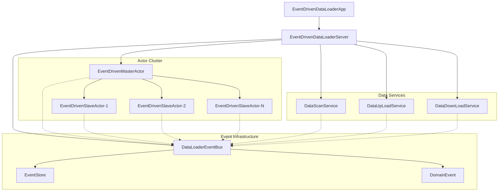
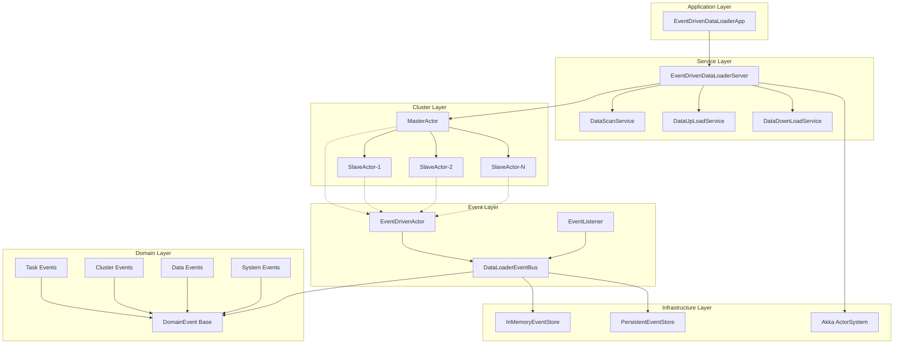
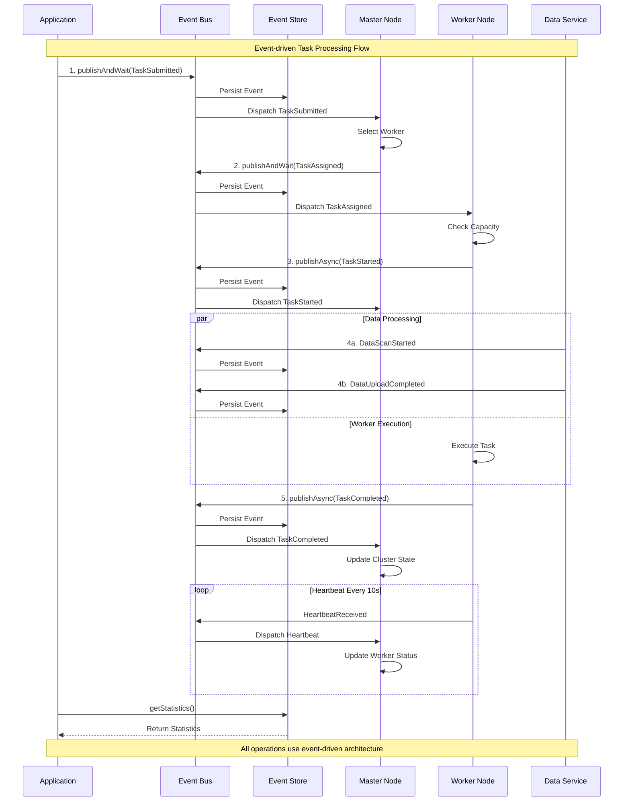
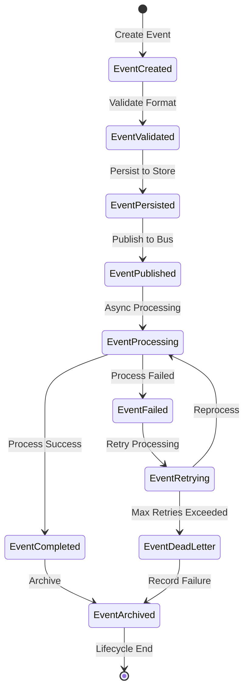

# 🚀 DataLoader - 事件驱动分布式任务管理系统

[]()
[]()
[]()
[]()

DataLoader是一个基于**事件驱动架构**的去中心化分布式任务管理系统，采用Scala + Akka技术栈实现，提供高可用、高性能、易扩展的数据处理能力。

## 📋 目录

- [核心特性](#-核心特性)
- [事件驱动架构](#-事件驱动架构)
- [系统架构图](#-系统架构图)
- [快速开始](#-快速开始)
- [项目结构](#-项目结构)
- [事件类型](#-事件类型)
- [使用示例](#-使用示例)
- [配置说明](#-配置说明)
- [监控运维](#-监控运维)

## ✨ 核心特性

### 🎯 事件驱动架构
- **事件溯源**: 完整的事件历史记录，支持状态重建
- **发布/订阅**: 基于类型安全的事件总线
- **异步处理**: 高性能的非阻塞事件处理
- **事件持久化**: 内存/数据库双模式存储

### 🔗 分布式集群
- **Master-Worker架构**: 自动负载均衡和故障转移
- **心跳监控**: 智能的节点健康检测
- **动态扩缩容**: 运行时添加/移除工作节点
- **去中心化**: 无单点故障设计

### 📊 数据处理
- **多协议支持**: FTP、HTTP、本地文件系统
- **流式处理**: 基于Akka Streams的背压控制
- **批量处理**: 高效的大数据处理能力
- **实时监控**: 完整的处理状态跟踪

### 🛠️ 运维友好
- **完整监控**: 系统指标、事件统计、性能分析
- **容错机制**: 自动重试、故障隔离、优雅降级
- **配置热更新**: 动态配置管理
- **可观测性**: 结构化日志、链路追踪

## 🏗️ 事件驱动架构

DataLoader采用领域驱动设计(DDD)和事件溯源(Event Sourcing)模式，通过事件驱动实现组件间的松耦合通信。

### 核心组件架构



**图表说明 (Chart Legend):**
- Event Infrastructure - 事件基础设施
- Actor Cluster - Actor集群系统  
- Data Services - 数据处理服务

## 📊 系统架构图

### 分层架构视图



**分层说明 (Layer Legend):**
- Application Layer - 应用层
- Service Layer - 服务层
- Cluster Layer - 集群层
- Event Layer - 事件层
- Domain Layer - 领域层
- Infrastructure Layer - 基础设施层

### 事件流序列图



**流程说明 (Process Legend):**
- Application - 应用程序
- Event Bus - 事件总线
- Event Store - 事件存储
- Master Node - Master节点
- Worker Node - Worker节点  
- Data Service - 数据服务

### 事件生命周期



**状态说明 (State Legend):**
- EventCreated - 事件已创建
- EventValidated - 事件已验证
- EventPersisted - 事件已持久化
- EventPublished - 事件已发布
- EventProcessing - 事件处理中
- EventCompleted - 事件已完成
- EventFailed - 事件处理失败
- EventRetrying - 事件重试中
- EventDeadLetter - 死信队列
- EventArchived - 事件已归档

## 🚀 快速开始

### 环境要求

- **Java**: JDK 8+
- **Scala**: 2.12.x
- **Maven**: 3.6+
- **内存**: 最少2GB

### 编译运行

```bash
# 1. 克隆项目
git clone <repository-url>
cd CodePrototypesDemo/demo/DataLoader

# 2. 编译项目
mvn clean compile

# 3. 运行事件驱动版本
mvn exec:java -Dexec.mainClass="com.hackerforfuture.codeprototypes.dataloader.EventDrivenDataLoaderApp"

# 4. 运行传统版本（对比）
mvn exec:java -Dexec.mainClass="com.hackerforfuture.codeprototypes.dataloader.DataLoader"
```

### Docker运行（推荐）

```bash
# 构建镜像
docker build -t dataloader:event-driven .

# 运行容器
docker run -p 8080:8080 dataloader:event-driven
```

## 📁 项目结构

```
src/main/scala/com/hackerforfuture/codeprototypes/dataloader/
├── 📱 EventDrivenDataLoaderApp.scala          # 事件驱动应用入口
├── 📱 DataLoader.scala                        # 传统应用入口
├── 
├── 🎯 events/                                 # 事件基础设施
│   ├── DomainEvent.scala                      # 领域事件定义
│   ├── EventBus.scala                         # 事件总线实现
│   ├── EventStore.scala                       # 事件存储
│   └── EventDrivenActor.scala                 # 事件驱动Actor基类
├── 
├── 🔗 clusters/                               # 集群管理
│   ├── Message.scala                          # 消息定义
│   ├── EventHandler.scala                     # 事件处理器
│   ├── master/
│   │   ├── EventDrivenMasterActor.scala       # 事件驱动Master
│   │   ├── MasterActor.scala                  # 传统Master
│   │   └── ...
│   └── worker/
│       ├── EventDrivenSlaveActor.scala        # 事件驱动Worker
│       ├── SlaveActor.scala                   # 传统Worker
│       └── ...
├── 
├── ⚙️ server/                                 # 服务层
│   ├── EventDrivenDataLoaderServer.scala     # 事件驱动服务器
│   ├── DataLoaderServer.scala                # 传统服务器
│   ├── upload/                               # 上传服务
│   ├── download/                             # 下载服务
│   └── dynamicscan/                          # 扫描服务
├── 
├── 📋 schedule/                               # 任务调度
│   ├── AntScheduler.scala                     # 调度器实现
│   ├── TaskScheduler.scala                   # 任务调度器
│   └── TaskGenerator.scala                   # 任务生成器
├── 
└── 🛠️ common/                                # 通用组件
    ├── LogSupport.scala                       # 日志支持
    ├── Configure.scala                       # 配置抽象
    └── ...
```

## 🎯 事件类型

### 任务管理事件
```scala
TaskSubmitted(taskId, taskType, priority, submittedBy)    // 任务提交
TaskAssigned(taskId, workerId)                           // 任务分配
TaskStarted(taskId, workerId)                            // 任务开始
TaskCompleted(taskId, workerId, result)                  // 任务完成
TaskFailed(taskId, workerId, error)                      // 任务失败
TaskCancelled(taskId, reason, cancelledBy)               // 任务取消
```

### 集群管理事件
```scala
WorkerRegistered(workerId, workerPath, capabilities)     // Worker注册
WorkerUnregistered(workerId, workerPath, reason)         // Worker注销
HeartbeatReceived(workerId, workerPath)                  // 心跳接收
WorkerTimedOut(workerId, workerPath, lastHeartbeat)      // Worker超时
MasterElected(masterId, masterPath)                      // Master选举
```

### 数据处理事件
```scala
DataScanStarted(scanId, scanType, targetPath)           // 扫描开始
DataDiscovered(scanId, fileCount, totalSize)            // 数据发现
DataUploadStarted(uploadId, sourceFile, targetLocation) // 上传开始
DataUploadCompleted(uploadId, bytesTransferred)         // 上传完成
DataDownloadStarted(downloadId, sourceLocation)         // 下载开始
DataDownloadCompleted(downloadId, bytesTransferred)     // 下载完成
```

### 系统管理事件
```scala
SystemStarted(systemId, systemVersion)                  // 系统启动
SystemShutdown(systemId, reason)                        // 系统关闭
ConfigurationUpdated(configKey, oldValue, newValue)     // 配置更新
```

## 💻 使用示例

### 基本事件发布/订阅

```scala
import com.hackerforfuture.codeprototypes.dataloader.events._

// 获取事件总线
val eventBus = EventDrivenDataLoaderServer.getEventBus.get

// 发布事件
eventBus.publishAndWait(TaskSubmitted(
  taskId = "task-001",
  taskType = "data-processing",
  priority = 5,
  submittedBy = "user-service"
))

// 订阅事件
val listener = new SimpleEventListener[TaskCompleted] {
  override def handleEvent(event: TaskCompleted): Unit = {
    println(s"任务 ${event.taskId} 已完成！")
  }
}
eventBus.subscribe(listener)
```

### 自定义事件处理器

```scala
class CustomTaskHandler extends EventDrivenActor {
  override def eventBus = /* 注入事件总线 */
  
  override protected def setupEventSubscriptions(): Unit = {
    // 订阅任务分配事件
    subscribeToEvent(classOf[TaskAssigned]) { event =>
      handleTaskAssignment(event)
    }
    
    // 订阅任务完成事件
    subscribeToEvent(classOf[TaskCompleted]) { event =>
      handleTaskCompletion(event)
    }
  }
  
  private def handleTaskAssignment(event: TaskAssigned): Unit = {
    log.info(s"收到任务分配: ${event.taskId} -> ${event.workerId}")
    // 处理任务分配逻辑
  }
  
  private def handleTaskCompletion(event: TaskCompleted): Unit = {
    log.info(s"任务完成: ${event.taskId}")
    // 处理任务完成逻辑
  }
}
```

### 事件查询和统计

```scala
// 获取事件存储
val eventStore = EventDrivenDataLoaderServer.getEventStore.get

// 查询特定聚合的事件历史
val taskEvents = eventStore.getEventsForAggregate("task-001")
println(s"任务 task-001 的完整历史: ${taskEvents.size} 个事件")

// 查询特定类型的事件
val completedTasks = eventStore.getEventsByType("TaskCompleted")
println(s"已完成任务数量: ${completedTasks.size}")

// 获取系统统计信息
val stats = eventStore.asInstanceOf[InMemoryEventStore].getStatistics
println(s"系统统计:")
println(s"  总事件数: ${stats.totalEvents}")
println(s"  聚合数: ${stats.aggregateCount}")
println(s"  事件类型数: ${stats.eventTypeCount}")
```

## ⚙️ 配置说明

### 应用配置
```hocon
# application.conf
dataloader {
  # 集群配置
  cluster {
    master {
      heartbeat-timeout = 10s
      initial-timeout = 5s
    }
    worker {
      max-concurrent-tasks = 3
      capabilities = ["data-processing", "file-transfer"]
    }
  }
  
  # 事件存储配置
  event-store {
    type = "memory"  # memory | persistent
    max-events = 50000
    # persistence-connection = "jdbc:postgresql://localhost/events"
  }
  
  # 数据处理配置
  data-processing {
    scan-interval = 30s
    upload-interval = 15s
    download-interval = 20s
  }
}
```

### 日志配置
```xml
<!-- log4j2.properties -->
<Configuration>
  <Appenders>
    <Console name="console">
      <PatternLayout pattern="%d{yyyy-MM-dd HH:mm:ss} %-5level [%thread] %logger{36} - %msg%n"/>
    </Console>
  </Appenders>
  
  <Loggers>
    <Logger name="com.hackerforfuture.codeprototypes.dataloader" level="DEBUG"/>
    <Logger name="akka" level="INFO"/>
    <Root level="INFO">
      <AppenderRef ref="console"/>
    </Root>
  </Loggers>
</Configuration>
```

## 📊 监控运维

### 系统指标

DataLoader提供丰富的监控指标：

```scala
// 获取系统状态
val systemStatus = EventDrivenDataLoaderServer.getSystemStatus
println(s"系统运行状态: ${systemStatus.isRunning}")
println(s"活跃Worker数量: ${systemStatus.workerCount}")

// 获取事件统计
val eventStats = EventDrivenDataLoaderServer.getEventStore
  .map(_.asInstanceOf[InMemoryEventStore].getStatistics)
eventStats.foreach { stats =>
  println(s"事件统计:")
  println(s"  总事件数: ${stats.totalEvents}")
  println(s"  聚合数量: ${stats.aggregateCount}")
  println(s"  事件类型: ${stats.eventTypeCount}")
}
```

### 健康检查

```bash
# 检查系统健康状态
curl http://localhost:8080/health

# 获取系统指标
curl http://localhost:8080/metrics

# 查看事件统计
curl http://localhost:8080/events/stats
```

### 性能调优

1. **内存优化**
   ```scala
   # 调整事件存储大小
   event-store.max-events = 100000
   
   # 调整JVM参数
   -Xms2g -Xmx4g -XX:+UseG1GC
   ```

2. **并发优化**
   ```scala
   # 增加Worker并发数
   worker.max-concurrent-tasks = 5
   
   # 调整Actor调度器
   akka.actor.default-dispatcher.throughput = 100
   ```

3. **网络优化**
   ```scala
   # 调整心跳间隔
   cluster.master.heartbeat-timeout = 15s
   
   # 优化Akka远程配置
   akka.remote.artery.advanced.compression = on
   ```

## 🤝 贡献指南

欢迎为DataLoader项目贡献代码！

### 开发流程

1. **Fork项目**: 创建你的功能分支
2. **编写代码**: 遵循Scala编码规范
3. **添加测试**: 确保测试覆盖率
4. **提交PR**: 详细描述变更内容

### 编码规范

- 遵循[Scala Style Guide](https://docs.scala-lang.org/style/)
- 使用有意义的变量和方法名
- 添加适当的注释和文档
- 保持代码简洁和可读性

### 测试要求

```bash
# 运行单元测试
mvn test

# 运行集成测试
mvn integration-test

# 生成测试报告
mvn scoverage:report
```

## 📄 许可证

本项目采用 [Apache License 2.0](LICENSE) 许可证。

## 📞 联系我们

- 🐛 **问题反馈**: [GitHub Issues](https://github.com/your-org/dataloader/issues)
- 💬 **技术讨论**: [GitHub Discussions](https://github.com/your-org/dataloader/discussions)
- 📧 **邮件联系**: dataloader-dev@your-org.com

---

<div align="center">

**⭐ 如果这个项目对你有帮助，请给我们一个Star！ ⭐**

Made with ❤️ by DataLoader Team

</div>
